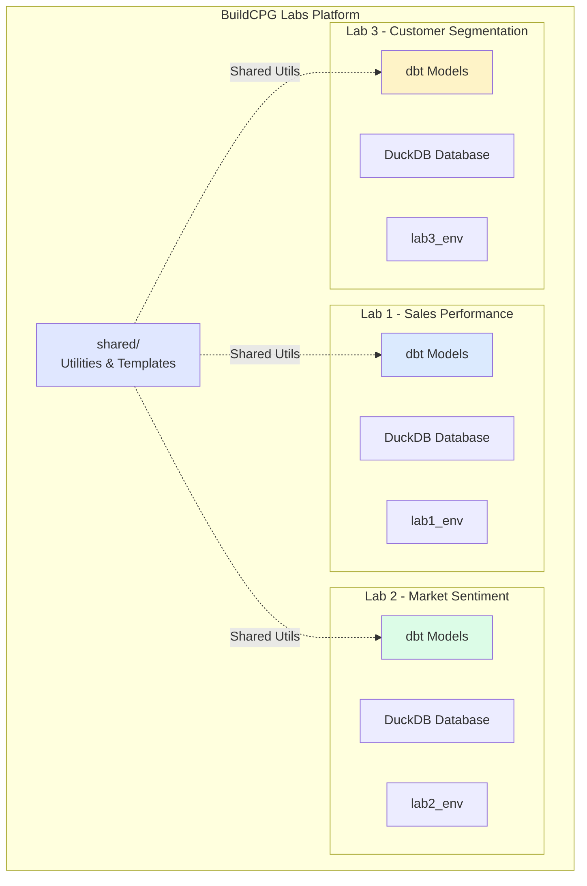
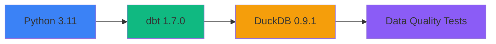
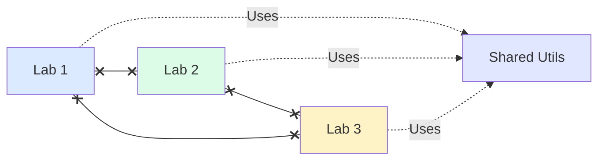
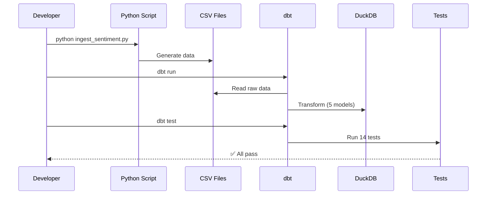

# BuildCPG Labs

A modern, scalable data engineering platform for managing multiple independent labs using dbt, DuckDB, and Python.

## Overview

BuildCPG Labs enables you to:

- **Run independent labs** - Each lab has its own database, data, and Python environment
- **Share utilities** - Common code used by all labs without duplication
- **Scale easily** - Create new labs in minutes using templates
- **Maintain quality** - Built-in data inspection and automated quality checks
- **Work efficiently** - Per-lab virtual environments with standardized workflows

## Architecture



## Key Features

### Multi-Lab Architecture with Per-Lab Environments

Each lab is completely independent:

```
buildcpg-labs/
├── shared/                     # Reusable utilities (ALL labs)
│   ├── utils/                  # DataInspector, CSVMonitor
│   └── config/                 # Central configuration
│
├── lab1_sales_performance/     # Lab 1 (Independent)
│   ├── lab1_env/              # Own virtual environment
│   ├── data/                  # Own database
│   └── dbt/                   # Own models
│
├── lab2_market_sentiment/      # Lab 2 (Independent)
│   ├── lab2_env/              # Own virtual environment
│   ├── data/                  # Own database
│   └── dbt/                   # Own models
│
└── lab3_customer_segmentation/ # Lab 3 (Independent)
    ├── lab3_env/              # Own virtual environment
    ├── data/                  # Own database
    └── dbt/                   # Own models
```

**Architecture Benefits:**
- ✅ **Complete isolation** - Each lab has dedicated environment
- ✅ **Independent data** - Each lab has its own DuckDB database
- ✅ **Dependency freedom** - Labs can use different package versions
- ✅ **No conflicts** - Work on multiple labs simultaneously
- ✅ **Shared utilities** - Common code available to all labs

## Current Labs

### Lab 1: Sales Performance Analysis
**Status:** ✅ Active  
**Purpose:** Analyze sales data with medallion architecture (Bronze → Silver → Gold)  
**Features:**
- Sales data processing
- Performance metrics
- Trend analysis

**Documentation:** See [Lab 1 Overview](labs/lab1-overview.md)

---

### Lab 2: Market Sentiment Analysis
**Status:** ✅ Active Development  
**Purpose:** Real-time CPG brand reputation monitoring  
**Features:**
- Reddit & News sentiment ingestion
- 5 dbt models with incremental processing
- 14 automated data quality tests
- Anomaly detection via z-scores
- Daily sentiment aggregations

**Key Metrics:**
- 📊 800 sentiment events
- 🧪 14/14 tests passing
- 🎯 5 CPG brands monitored
- ⚡ ~3 second build time

**Technology Stack:**


**Documentation:** 
- [Lab 2 Overview](labs/lab2-overview.md) - Architecture & features
- [Lab 2 Setup](labs/lab2-setup.md) - Installation guide
- [Lab 2 Data Models](labs/lab2-data-models.md) - Complete model reference
- [Lab 2 Troubleshooting](labs/lab2-troubleshooting.md) - Issue solutions
- [Lab 2 Quick Reference](labs/lab2-quick-reference.md) - Common commands

---

### Lab 3: Customer Segmentation
**Status:** 📋 Planned  
**Purpose:** Customer behavior analysis and segmentation  
**Features:** (Coming soon)

## Platform Statistics

| Metric | Value |
|--------|-------|
| Active Labs | 2 |
| Total Data Models | 10+ |
| Data Quality Tests | 20+ |
| Shared Utilities | 5 |
| Documentation Pages | 15+ |

## Quick Start

### 1. Clone Repository
```bash
git clone https://github.com/narensham/buildcpg-labs.git
cd buildcpg-labs
```

### 2. Work with Lab 2 (Example)
```bash
# Navigate to lab
cd lab2_market_sentiment

# Create virtual environment
python3 -m venv lab2_env
source lab2_env/bin/activate

# Install dependencies
pip install -r requirements.txt

# Setup dbt
cd dbt
dbt deps
dbt debug

# Generate sample data
cd ..
python pipelines/ingest_sentiment.py

# Run pipeline
cd dbt
dbt build
```

### 3. Verify Success
```bash
# All tests should pass
dbt test

# Expected output:
# ✅ PASS=14 WARN=0 ERROR=0 SKIP=0 TOTAL=14
```

## Platform Structure

```
buildcpg-labs/
│
├── shared/                          # Shared utilities
│   ├── utils/
│   │   ├── data_inspector.py       # Database inspection
│   │   ├── csv_monitor.py          # Data change detection
│   │   └── config_loader.py        # Configuration management
│   ├── config/
│   │   ├── labs_config.yaml        # Lab registry
│   │   └── paths.py                # Path helpers
│   └── templates/                  # Lab templates
│
├── lab1_sales_performance/         # Independent Lab 1
│   ├── lab1_env/                   # Virtual environment
│   ├── data/
│   │   ├── raw/                    # Source data
│   │   └── lab1.duckdb             # Database
│   ├── dbt/
│   │   ├── models/                 # Transformations
│   │   ├── tests/                  # Quality tests
│   │   └── profiles.yml            # DB connection
│   ├── pipelines/                  # Data ingestion
│   └── requirements.txt            # Dependencies
│
├── lab2_market_sentiment/          # Independent Lab 2
│   ├── lab2_env/                   # Virtual environment
│   ├── data/
│   │   ├── raw/                    # Source data
│   │   └── lab2.duckdb             # Database
│   ├── dbt/
│   │   ├── models/
│   │   │   ├── staging/           # Bronze layer
│   │   │   ├── intermediate/      # Silver layer
│   │   │   └── mart/              # Gold layer
│   │   ├── macros/                # Reusable SQL
│   │   ├── tests/                 # Quality tests
│   │   └── schema.yml             # Contracts
│   ├── pipelines/
│   │   └── ingest_sentiment.py   # Data generation
│   └── requirements.txt           # Dependencies
│
├── docs/                           # Documentation (MkDocs)
│   ├── architecture/
│   ├── getting-started/
│   ├── labs/
│   │   ├── lab1-*.md
│   │   └── lab2-*.md              # Lab 2 documentation
│   └── utilities/
│
├── .github/
│   └── workflows/
│       └── docs.yml               # Auto-deploy docs
│
├── mkdocs.yml                      # Documentation config
└── README.md
```

## Technology Stack

| Layer | Technology | Purpose |
|-------|------------|---------|
| **Database** | DuckDB 0.9.1 | Embedded, Mac-compatible, no Docker |
| **Transformation** | dbt 1.7.0 | Data modeling & testing |
| **Language** | Python 3.11+ | Scripting & ingestion |
| **Testing** | dbt_expectations | Data quality validation |
| **Documentation** | MkDocs Material | Auto-generated docs |
| **CI/CD** | GitHub Actions | Automated deployments |
| **Orchestration** | Manual (Airflow planned) | Pipeline scheduling |

## Design Principles

### 1. Lab Independence

- Each lab has own database
- Each lab has own environment
- Labs don't interfere with each other

### 2. Medallion Architecture
All labs follow Bronze → Silver → Gold pattern:
- **Bronze (Staging):** Raw data, minimal transformation
- **Silver (Intermediate):** Cleaned, enriched, business logic
- **Gold (Marts):** Analytics-ready aggregates

### 3. Data Quality First
- Automated tests on every run
- Contract enforcement where needed
- Quality flags and validation
- Comprehensive test coverage

### 4. Documentation Driven
- Every lab fully documented
- Architecture diagrams
- Troubleshooting guides
- Quick reference cards
- Auto-deployed to GitHub Pages

## Workflow Example (Lab 2)



## Common Tasks

### Check Lab Status
```bash
# From buildcpg-labs root
ls -la | grep lab

# Lab specific status
cd lab2_market_sentiment
dbt debug
dbt list
```

### Run Specific Lab
```bash
cd lab2_market_sentiment
source lab2_env/bin/activate
cd dbt
dbt run
dbt test
```

### View Documentation
```bash
# Serve locally
mkdocs serve

# Visit: http://127.0.0.1:8000
```

### Create New Lab (Future)
```bash
./setup_new_lab.sh lab3_customer_segmentation
```

## Documentation

### Getting Started
- [Quick Start Guide](getting-started/quick-start.md)
- [Installation Guide](getting-started/installation.md)

### Architecture
- [System Overview](architecture/overview.md)
- [Multi-Lab Design](architecture/multi-lab-design.md)
- [Medallion Architecture](architecture/medallion-architecture.md)
- [Shared vs Lab-Specific](architecture/shared-vs-lab-specific.md)

### Lab Documentation
- **Lab 1:**
  - [Overview](labs/lab1-overview.md)
  - [Setup](labs/lab1-setup.md)
  - [Data Models](labs/lab1-data-models.md)

- **Lab 2:** ⭐ NEW
  - [Overview](labs/lab2-overview.md)
  - [Setup](labs/lab2-setup.md)
  - [Data Models](labs/lab2-data-models.md)
  - [Troubleshooting](labs/lab2-troubleshooting.md)
  - [Quick Reference](labs/lab2-quick-reference.md)

### Utilities
- [Data Inspector](utilities/data-inspector.md)
- [CSV Monitor](utilities/csv-monitor.md)

### Support
- [Troubleshooting](troubleshooting.md)
- [FAQ](faq.md)

## Project Status

### Phase 1: Foundation ✅ COMPLETE
- ✅ Shared utilities (DataInspector, CSVMonitor)
- ✅ Central configuration
- ✅ Lab1 working
- ✅ Lab2 working with full documentation

### Phase 2: Enhanced Lab 2 ✅ COMPLETE
- ✅ Market sentiment analysis pipeline
- ✅ 5 dbt models with incremental processing
- ✅ 14 automated data quality tests
- ✅ Comprehensive documentation with diagrams
- ✅ Troubleshooting guide
- ✅ Quick reference card
- ✅ Reference architecture diagrams

### Phase 3: Platform Expansion 🔄 IN PROGRESS
- 🔄 Lab 3 (Customer Segmentation)
- 🔄 Streamlit dashboards
- 🔄 Real API integrations (PRAW, NewsAPI)
- 📋 Advanced sentiment analysis (Hugging Face)

### Phase 4: Production Readiness 📋 PLANNED
- 📋 Airflow orchestration
- 📋 CI/CD for data pipelines
- 📋 Monitoring & alerting
- 📋 Data quality gates
- 📋 Performance optimization

## What's New in Lab 2

### Key Achievements
1. **Complete Sentiment Pipeline**
   - Reddit + News data ingestion
   - 5-layer transformation (Staging → Intermediate → Marts)
   - Incremental processing for efficiency

2. **Robust Data Quality**
   - 14 automated tests (100% passing)
   - Contract enforcement on critical models
   - Quality flags and validation
   - Anomaly detection

3. **Comprehensive Documentation**
   - Full architecture diagrams (Mermaid)
   - Step-by-step setup guide
   - Complete model reference with schemas
   - Troubleshooting for all issues encountered
   - Quick reference card

4. **Battle-Tested Solutions**
   - Resolved duplicate key issues
   - Fixed contract enforcement problems
   - Solved CTE reference errors
   - Optimized incremental logic

### Lab 2 Metrics
- **Models:** 5 (2 staging, 1 intermediate, 2 marts)
- **Tests:** 14 (all passing)
- **Data Quality:** 100%
- **Documentation:** 5 comprehensive guides
- **Build Time:** ~3 seconds
- **Code Coverage:** All models documented

## Learning Path

### Beginners
1. Read [Quick Start](getting-started/quick-start.md)
2. Complete Lab 1 setup
3. Understand [Medallion Architecture](architecture/medallion-architecture.md)

### Intermediate
1. Complete Lab 2 setup
2. Study [Lab 2 Data Models](labs/lab2-data-models.md)
3. Learn dbt best practices

### Advanced
1. Customize Lab 2 for real data sources
2. Build Lab 3 from scratch
3. Implement Airflow orchestration
4. Create production dashboards

## Contributing

### Report Issues
Found a bug or have a suggestion?
- Create a GitHub issue
- Include error messages and steps to reproduce
- Reference relevant documentation

### Improve Documentation
- Fix typos or unclear sections
- Add examples or diagrams
- Share your use cases

## Support

- 📖 **[Read the docs](https://narensham.github.io/buildcpg-labs)**
- ❓ **[Check FAQ](faq.md)**
- 🔧 **[Troubleshooting guides](troubleshooting.md)**
- 🐛 **[GitHub Issues](https://github.com/narensham/buildcpg-labs/issues)**

---

## Requirements

- **Python:** 3.11+
- **OS:** Mac 11+, Linux, or Windows with WSL2
- **Memory:** 2GB minimum
- **Disk:** 1GB base + data per lab
- **Skills:** Basic terminal, SQL, Python

---

## Quick Wins

Get started in 10 minutes:
```bash
# Clone
git clone https://github.com/narensham/buildcpg-labs.git
cd buildcpg-labs/lab2_market_sentiment

# Setup
python3 -m venv lab2_env && source lab2_env/bin/activate
pip install -r requirements.txt

# Run
python pipelines/ingest_sentiment.py
cd dbt && dbt deps && dbt build

# Success!
# ✅ 14/14 tests passing
```

---

**Platform:** Multi-Lab Data Engineering  
**Architecture:** Independent labs + shared utilities  
**Current Labs:** 2 active, 1 planned  
**Last Updated:** November 2025  
**Maintainer:** narensham  
**Repository:** [GitHub](https://github.com/narensham/buildcpg-labs)  
**Documentation:** [GitHub Pages](https://narensham.github.io/buildcpg-labs)