# Lab 2: Data Models Reference

Complete reference for all data models in the Market Sentiment Analysis lab with schemas, lineage, and examples.

## Model Hierarchy

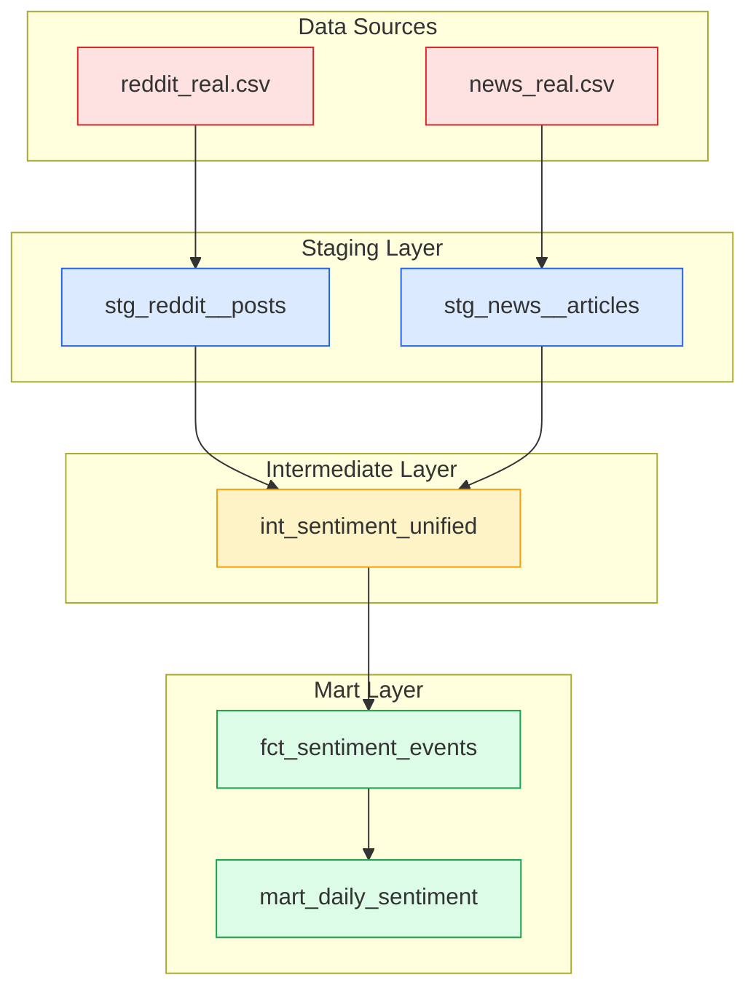

## Architecture Overview

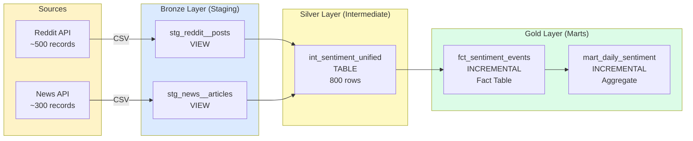

---

## Staging Layer

### stg_reddit__posts

**Purpose:** Clean and standardize Reddit post data from raw CSV files.

**Materialization:** View (real-time freshness)

**Source:** `data/raw/reddit_real.csv`

**Transformations:**
- Column renaming to snake_case
- Type casting for proper data types
- Timestamp parsing and validation
- Basic null handling

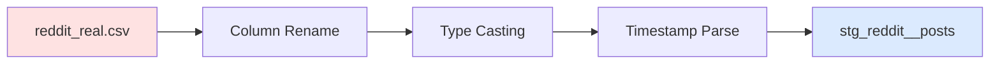

**Schema:**

| Column | Type | Nullable | Description | Example |
|--------|------|----------|-------------|---------|
| post_id | VARCHAR | No | Unique Reddit post identifier | `reddit_00042` |
| author | VARCHAR | Yes | Reddit username | `user_5234` |
| brand | VARCHAR | No | Brand mentioned | `Coca-Cola` |
| title | VARCHAR | Yes | Post title | `Post about brand 42` |
| body | VARCHAR | Yes | Post body text | `Discussion about CPG...` |
| upvotes | BIGINT | Yes | Number of upvotes | `3452` |
| comments_count | BIGINT | Yes | Number of comments | `127` |
| created_at | TIMESTAMP | No | Post creation time | `2024-11-15 14:23:11` |
| sentiment_score | DOUBLE | No | Sentiment (-1 to 1) | `0.435` |
| source | VARCHAR | No | Always 'reddit' | `reddit` |
| ingested_at | TIMESTAMP | No | Ingestion timestamp | `2025-01-15 10:30:00` |

**Row Count:** ~500 records

**Sample SQL:**
```sql
-- View Reddit sentiment by brand
SELECT 
    brand,
    COUNT(*) as post_count,
    AVG(sentiment_score) as avg_sentiment,
    AVG(upvotes) as avg_upvotes,
    AVG(comments_count) as avg_comments
FROM {{ ref('stg_reddit__posts') }}
GROUP BY brand
ORDER BY avg_sentiment DESC;
```

**Quality Checks:**
- No NULL post_ids
- Valid timestamps (not future dates)
- Sentiment scores in valid range

---

### stg_news__articles

**Purpose:** Clean and standardize news article data from raw CSV files.

**Materialization:** View (real-time freshness)

**Source:** `data/raw/news_real.csv`

**Transformations:**
- Column renaming to snake_case
- Type casting for proper data types
- URL validation
- Timestamp parsing

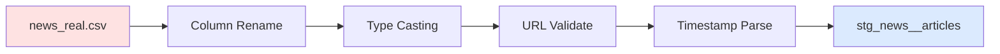

**Schema:**

| Column | Type | Nullable | Description | Example |
|--------|------|----------|-------------|---------|
| article_id | VARCHAR | No | Unique article identifier | `news_00123` |
| publication | VARCHAR | Yes | News source | `Forbes` |
| brand | VARCHAR | No | Brand mentioned | `PepsiCo` |
| headline | VARCHAR | Yes | Article headline | `News: PepsiCo announces...` |
| body | VARCHAR | Yes | Article body | `Article content...` |
| url | VARCHAR | Yes | Article URL | `https://example.com/article-123` |
| published_at | TIMESTAMP | No | Publication time | `2024-12-01 09:15:00` |
| sentiment_score | DOUBLE | No | Sentiment (-1 to 1) | `-0.234` |
| source | VARCHAR | No | Always 'news' | `news` |
| ingested_at | TIMESTAMP | No | Ingestion timestamp | `2025-01-15 10:30:00` |

**Row Count:** ~300 records

**Sample SQL:**
```sql
-- Top publications by sentiment
SELECT 
    publication,
    COUNT(*) as article_count,
    AVG(sentiment_score) as avg_sentiment,
    MIN(sentiment_score) as min_sentiment,
    MAX(sentiment_score) as max_sentiment
FROM {{ ref('stg_news__articles') }}
GROUP BY publication
ORDER BY article_count DESC;
```

**Quality Checks:**
- No NULL article_ids
- Valid URLs format
- Valid timestamps

---

## Intermediate Layer

### int_sentiment_unified

**Purpose:** Unified sentiment data with business logic, enrichment, and quality validation.

**Materialization:** Table (full refresh)

**Sources:** 
- {{ ref('stg_reddit__posts') }}
- {{ ref('stg_news__articles') }}

**Key Features:**
- 🔑 Surrogate key generation for unique identification
- 📊 Sentiment categorization (positive/negative/neutral)
- 📈 Engagement metrics and percentiles
- 📉 7-day moving averages
- ✅ Quality validation and flags
- 🔄 Window functions for trends

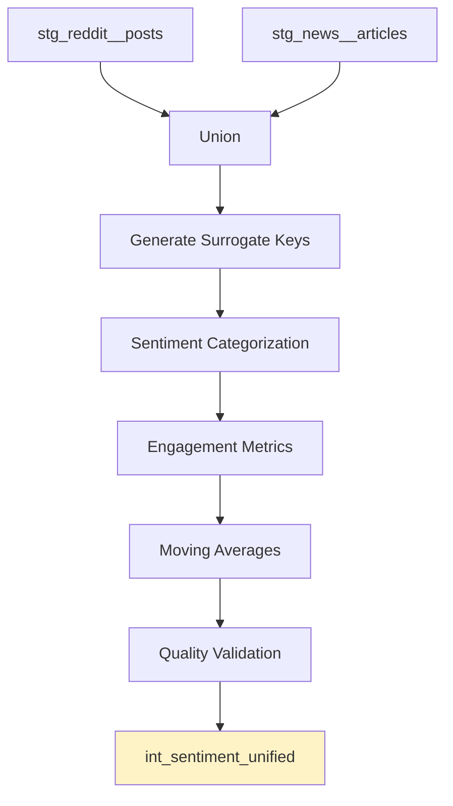

**Schema:**

| Column | Type | Description | Business Logic |
|--------|------|-------------|----------------|
| **Keys & Identifiers** |
| sentiment_event_id | VARCHAR | Unique event identifier | `md5(content_id + published_at + source)` |
| brand_key | VARCHAR | Brand surrogate key | `md5(brand)` |
| source_key | INTEGER | Source identifier | `1=reddit, 2=news` |
| content_id | VARCHAR | Source-specific ID | From source system |
| content_hash | VARCHAR | Content hash | For deduplication |
| **Core Data** |
| creator | VARCHAR | Author/publication | Username or publication name |
| brand | VARCHAR | Brand name | `Coca-Cola`, `PepsiCo`, etc |
| headline | VARCHAR | Title/headline | Post title or article headline |
| body_text | VARCHAR | Full content | Complete text content |
| **Sentiment Metrics** |
| sentiment_score | DOUBLE | Sentiment score | `-1` to `1` range |
| sentiment_category | VARCHAR | Category | `positive/negative/neutral` |
| **Engagement Metrics** |
| engagement_count | BIGINT | Engagement metric | Upvotes/shares/likes |
| engagement_percentile | DOUBLE | Percentile rank | `0.0` to `1.0` |
| post_rank_by_brand | BIGINT | Rank within brand | By engagement DESC |
| **Temporal Data** |
| published_at | TIMESTAMP | Publication time | When content was published |
| source | VARCHAR | Source platform | `reddit` or `news` |
| ingested_at | TIMESTAMP | Ingestion time | When data was loaded |
| **Trend Analysis** |
| moving_avg_sentiment_7d | DOUBLE | 7-day MA | Rolling average sentiment |
| sentiment_change | DOUBLE | Change from previous | Sentiment delta |
| **Metadata** |
| _dbt_load_date | TIMESTAMP | dbt load timestamp | When model ran |
| _dbt_run_timestamp | VARCHAR | dbt run identifier | Run batch ID |

**Row Count:** ~800 records (Reddit + News combined)

**Business Logic Implementation:**

#### 1. Sentiment Categorization
```sql
CASE 
    WHEN sentiment_score >= {{ var('sentiment_threshold_positive') }} THEN 'positive'
    WHEN sentiment_score <= {{ var('sentiment_threshold_negative') }} THEN 'negative'
    ELSE 'neutral'
END as sentiment_category
```
**Thresholds:** `positive >= 0.3`, `negative <= -0.3`

#### 2. Engagement Percentile
```sql
ROUND(
    (engagement_count) / 
    NULLIF(MAX(engagement_count) OVER (), 0),
    3
) as engagement_percentile
```

#### 3. Brand Ranking
```sql
ROW_NUMBER() OVER (
    PARTITION BY brand 
    ORDER BY engagement_count DESC
) as post_rank_by_brand
```

#### 4. Moving Average (7-day)
```sql
AVG(sentiment_score) OVER (
    PARTITION BY brand 
    ORDER BY published_at 
    ROWS BETWEEN 6 PRECEDING AND CURRENT ROW
) as moving_avg_sentiment_7d
```

#### 5. Sentiment Change
```sql
sentiment_score - LAG(sentiment_score) OVER (
    PARTITION BY brand 
    ORDER BY published_at
) as sentiment_change
```

**Data Flow Diagram:**

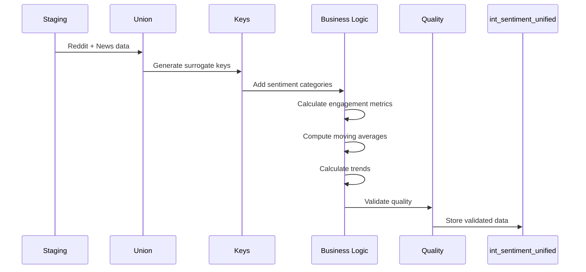

**Quality Filters:**
- ✅ Sentiment score between -1 and 1
- ✅ No future dates
- ✅ No NULL required fields
- ✅ Valid brand names

**Sample Queries:**

```sql
-- Top performing content by brand
SELECT 
    brand,
    headline,
    sentiment_score,
    engagement_count,
    engagement_percentile,
    post_rank_by_brand
FROM {{ ref('int_sentiment_unified') }}
WHERE post_rank_by_brand <= 10
ORDER BY brand, post_rank_by_brand;

-- Sentiment trends over time
SELECT 
    brand,
    DATE_TRUNC('day', published_at) as date,
    AVG(sentiment_score) as daily_sentiment,
    AVG(moving_avg_sentiment_7d) as trend_7d,
    COUNT(*) as content_count
FROM {{ ref('int_sentiment_unified') }}
GROUP BY brand, DATE_TRUNC('day', published_at)
ORDER BY brand, date;

-- Sentiment distribution
SELECT 
    sentiment_category,
    COUNT(*) as count,
    ROUND(AVG(sentiment_score), 3) as avg_score,
    ROUND(AVG(engagement_count), 0) as avg_engagement
FROM {{ ref('int_sentiment_unified') }}
GROUP BY sentiment_category
ORDER BY avg_score DESC;
```

---

## Mart Layer

### fct_sentiment_events

**Purpose:** Fact table for all sentiment events (granular, event-level data).

**Materialization:** Incremental (delete+insert strategy)

**Grain:** One row per sentiment event (Reddit post or news article)

**Unique Key:** `sentiment_event_id`

**Source:** {{ ref('int_sentiment_unified') }}

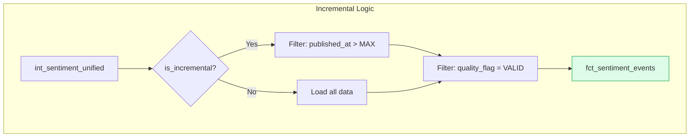

**Schema:**

| Column | Type | Contract | Description |
|--------|------|----------|-------------|
| **Primary Key** |
| sentiment_event_id | VARCHAR | ✅ NOT NULL, UNIQUE | Unique event identifier |
| **Foreign Keys** |
| brand_key | VARCHAR | ✅ NOT NULL | Brand dimension key |
| source_key | INTEGER | | Source identifier (1=reddit, 2=news) |
| **Descriptive Attributes** |
| content_id | VARCHAR | | Source-specific content ID |
| creator | VARCHAR | | Author or publication name |
| brand | VARCHAR | | Brand name |
| headline | VARCHAR | | Post title or article headline |
| body_text | VARCHAR | | Full content text |
| source | VARCHAR | | Platform (reddit/news) |
| **Metrics** |
| engagement_count | BIGINT | | Upvotes, shares, likes |
| sentiment_score | DOUBLE | ✅ NOT NULL, [-1,1] | Sentiment score |
| sentiment_category | VARCHAR | | positive/negative/neutral |
| **Temporal Dimensions** |
| published_at | TIMESTAMP | | Original publish time |
| published_date | DATE | ✅ NOT NULL | Publish date (for partitioning) |
| published_year | BIGINT | | Year (for aggregation) |
| published_month | BIGINT | | Month 1-12 |
| published_day_of_week | BIGINT | | Day 0-6 (0=Monday) |
| published_hour | BIGINT | | Hour 0-23 |
| ingested_at | TIMESTAMP | | Data ingestion time |
| **Quality & Metadata** |
| quality_flag | VARCHAR | ✅ Accepted values | VALID/INVALID_SENTIMENT/NULL_HEADLINE |
| _dbt_updated_at | TIMESTAMP | | Last update time |
| _dbt_run_timestamp | VARCHAR | | dbt run identifier |

**Row Count:** ~800 records (only VALID quality_flag)

**Incremental Logic:**

```sql
WITH base_data AS (
    SELECT *,
        CASE 
            WHEN NOT {{ validate_sentiment('sentiment_score') }} THEN 'INVALID_SENTIMENT'
            WHEN headline IS NULL THEN 'NULL_HEADLINE'
            ELSE 'VALID'
        END as quality_flag
    FROM {{ ref('int_sentiment_unified') }}
    
    
    WHERE published_at > (SELECT MAX(published_at) FROM {{ this }})
    
)

SELECT * FROM base_data
WHERE quality_flag = 'VALID'
```

**Data Quality Tests:**

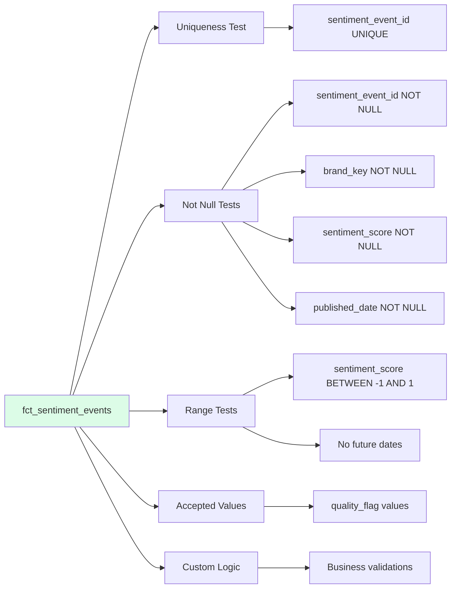

**Sample Queries:**

```sql
-- Daily sentiment by brand
SELECT 
    published_date,
    brand,
    COUNT(*) as event_count,
    ROUND(AVG(sentiment_score), 3) as avg_sentiment,
    SUM(engagement_count) as total_engagement
FROM {{ ref('fct_sentiment_events') }}
GROUP BY published_date, brand
ORDER BY published_date DESC, brand;

-- Sentiment distribution
SELECT 
    sentiment_category,
    COUNT(*) as count,
    ROUND(COUNT(*) * 100.0 / SUM(COUNT(*)) OVER (), 2) as pct,
    ROUND(AVG(sentiment_score), 3) as avg_score,
    ROUND(AVG(engagement_count), 0) as avg_engagement
FROM {{ ref('fct_sentiment_events') }}
GROUP BY sentiment_category
ORDER BY count DESC;

-- Top brands by positive sentiment
SELECT 
    brand,
    COUNT(*) as total_mentions,
    SUM(CASE WHEN sentiment_category = 'positive' THEN 1 ELSE 0 END) as positive_mentions,
    ROUND(AVG(sentiment_score), 3) as avg_sentiment,
    ROUND(AVG(engagement_count), 0) as avg_engagement
FROM {{ ref('fct_sentiment_events') }}
GROUP BY brand
ORDER BY avg_sentiment DESC;

-- Temporal patterns (hourly)
SELECT 
    published_hour,
    COUNT(*) as event_count,
    ROUND(AVG(sentiment_score), 3) as avg_sentiment
FROM {{ ref('fct_sentiment_events') }}
GROUP BY published_hour
ORDER BY published_hour;
```

---

### mart_daily_sentiment

**Purpose:** Daily aggregated sentiment metrics by brand with anomaly detection.

**Materialization:** Incremental (delete+insert strategy)

**Grain:** One row per (date, brand) combination

**Unique Key:** ['sentiment_date', 'brand']

**Source:** {{ ref('fct_sentiment_events') }}

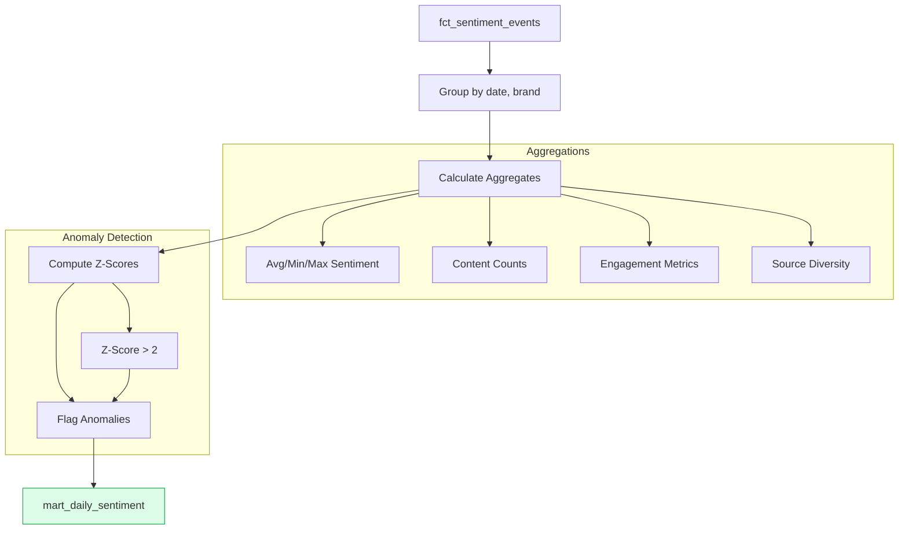

**Schema:**

| Column | Type | Contract | Description | Calculation |
|--------|------|----------|-------------|-------------|
| **Dimensions** |
| sentiment_date | DATE | ✅ NOT NULL | Aggregation date | `CAST(published_date AS DATE)` |
| brand | VARCHAR | | Brand name | Dimension |
| **Sentiment Metrics** |
| avg_sentiment | DOUBLE | ✅ [-1,1] | Average sentiment | `AVG(sentiment_score)` |
| min_sentiment | DOUBLE | | Minimum sentiment | `MIN(sentiment_score)` |
| max_sentiment | DOUBLE | | Maximum sentiment | `MAX(sentiment_score)` |
| stddev_sentiment | DOUBLE | | Standard deviation | `STDDEV(sentiment_score)` |
| **Content Counts** |
| content_count | BIGINT | | Total pieces of content | `COUNT(*)` |
| positive_count | BIGINT | | Positive content count | `SUM(CASE category = 'positive')` |
| negative_count | BIGINT | | Negative content count | `SUM(CASE category = 'negative')` |
| neutral_count | BIGINT | | Neutral content count | `SUM(CASE category = 'neutral')` |
| positive_ratio | DOUBLE | | Ratio of positive | `positive_count / content_count` |
| **Engagement** |
| total_engagement | HUGEINT | | Sum of all engagement | `SUM(engagement_count)` |
| avg_engagement | DOUBLE | | Average engagement | `AVG(engagement_count)` |
| **Diversity** |
| source_count | BIGINT | | Unique sources | `COUNT(DISTINCT source)` |
| **Anomaly Detection** |
| z_score_sentiment | DOUBLE | | Statistical z-score | `(avg - brand_avg) / brand_stddev` |
| anomaly_flag | VARCHAR | ✅ Accepted values | NORMAL/ANOMALY | `ABS(z_score) > 2` |
| **Metadata** |
| mart_load_date | TIMESTAMP | | Mart load time | `get_current_timestamp()` |

**Aggregation Logic:**

```sql
SELECT
    CAST(published_date AS DATE) as sentiment_date,
    brand,
    
    -- Sentiment metrics
    AVG(sentiment_score) as avg_sentiment,
    MIN(sentiment_score) as min_sentiment,
    MAX(sentiment_score) as max_sentiment,
    STDDEV(sentiment_score) as stddev_sentiment,
    
    -- Content counts
    COUNT(*) as content_count,
    SUM(CASE WHEN sentiment_category = 'positive' THEN 1 ELSE 0 END) as positive_count,
    SUM(CASE WHEN sentiment_category = 'negative' THEN 1 ELSE 0 END) as negative_count,
    SUM(CASE WHEN sentiment_category = 'neutral' THEN 1 ELSE 0 END) as neutral_count,
    positive_count::DOUBLE / NULLIF(content_count, 0) as positive_ratio,
    
    -- Engagement
    SUM(engagement_count) as total_engagement,
    AVG(engagement_count) as avg_engagement,
    
    -- Diversity
    COUNT(DISTINCT source) as source_count,
    
    -- Anomaly detection
    (avg_sentiment - AVG(avg_sentiment) OVER (PARTITION BY brand)) /
    NULLIF(STDDEV(avg_sentiment) OVER (PARTITION BY brand), 0) as z_score_sentiment,
    
    CASE
        WHEN ABS(z_score_sentiment) > 2 THEN 'ANOMALY'
        ELSE 'NORMAL'
    END as anomaly_flag,
    
    get_current_timestamp() as mart_load_date

FROM {{ ref('fct_sentiment_events') }}
GROUP BY sentiment_date, brand
```

**Anomaly Detection Visualization:**

```mermaid
graph LR
    A[Daily Sentiment] --> B[Calculate Brand Mean]
    A --> C[Calculate Brand StdDev]
    B --> D[Compute Z-Score]
    C --> D
    D --> E{|Z-Score| > 2?}
    E -->|Yes| F[ANOMALY]
    E -->|No| G[NORMAL]
    
    style F fill:#fee2e2,stroke:#dc2626
    style G fill:#dcfce7,stroke:#16a34a
```

**Incremental Logic:**

```sql

    WHERE sentiment_date > (SELECT MAX(sentiment_date) FROM {{ this }})

```

**Sample Queries:**

```sql
-- Recent anomalies
SELECT 
    sentiment_date,
    brand,
    ROUND(avg_sentiment, 3) as avg_sentiment,
    ROUND(z_score_sentiment, 2) as z_score,
    anomaly_flag,
    content_count
FROM {{ ref('mart_daily_sentiment') }}
WHERE anomaly_flag = 'ANOMALY'
    AND sentiment_date >= CURRENT_DATE - INTERVAL '7 days'
ORDER BY sentiment_date DESC, ABS(z_score_sentiment) DESC;

-- Brand comparison
SELECT 
    brand,
    ROUND(AVG(avg_sentiment), 3) as overall_sentiment,
    ROUND(AVG(positive_ratio), 3) as positive_ratio,
    SUM(content_count) as total_mentions,
    ROUND(AVG(avg_engagement), 0) as avg_engagement,
    SUM(CASE WHEN anomaly_flag = 'ANOMALY' THEN 1 ELSE 0 END) as anomaly_days
FROM {{ ref('mart_daily_sentiment') }}
GROUP BY brand
ORDER BY overall_sentiment DESC;

-- Trend analysis (7-day)
SELECT 
    sentiment_date,
    brand,
    ROUND(avg_sentiment, 3) as sentiment,
    ROUND(LAG(avg_sentiment, 7) OVER (PARTITION BY brand ORDER BY sentiment_date), 3) as sentiment_7d_ago,
    ROUND(avg_sentiment - LAG(avg_sentiment, 7) OVER (PARTITION BY brand ORDER BY sentiment_date), 3) as change_7d
FROM {{ ref('mart_daily_sentiment') }}
WHERE sentiment_date >= CURRENT_DATE - INTERVAL '30 days'
ORDER BY brand, sentiment_date;

-- Weekly summary
SELECT 
    DATE_TRUNC('week', sentiment_date) as week_start,
    brand,
    ROUND(AVG(avg_sentiment), 3) as weekly_sentiment,
    SUM(content_count) as weekly_mentions,
    ROUND(AVG(positive_ratio), 3) as avg_positive_ratio
FROM {{ ref('mart_daily_sentiment') }}
GROUP BY DATE_TRUNC('week', sentiment_date), brand
ORDER BY week_start DESC, brand;
```

---

## Macros

### generate_surrogate_key

**Purpose:** Generate MD5 hash-based surrogate keys for unique identification.

**Location:** `dbt/macros/generate_surrogate_key.sql`

**Usage:**
```sql
{{ generate_surrogate_key(['column1', 'column2', 'column3']) }}
```

**Implementation:**
```sql

    md5(concat(
        
            coalesce(cast({{ col }} as varchar), '')
            ,
        
    ))

```

**Example:**
```sql
-- Generate unique event ID
{{ generate_surrogate_key(['content_id', 'published_at', 'source']) }} as sentiment_event_id
```

---

### validate_sentiment

**Purpose:** Validate sentiment scores are within acceptable range.

**Location:** `dbt/macros/validate_sentiment.sql`

**Usage:**
```sql
WHERE {{ validate_sentiment('sentiment_score') }}
```

**Implementation:**
```sql

    ({{ column_name }} >= -1 AND {{ column_name }} <= 1)

```

---

### get_current_timestamp

**Purpose:** Get current timestamp consistently across models.

**Location:** `dbt/macros/get_current_timestamp.sql`

**Usage:**
```sql
get_current_timestamp() as load_timestamp
```

---

## Data Lineage Complete View

```mermaid
graph TB
    subgraph "Raw Data"
        R[reddit_real.csv<br/>500 rows]
        N[news_real.csv<br/>300 rows]
    end
    
    subgraph "Bronze - Staging"
        SR[stg_reddit__posts<br/>VIEW<br/>500 rows]
        SN[stg_news__articles<br/>VIEW<br/>300 rows]
    end
    
    subgraph "Silver - Intermediate"
        IU[int_sentiment_unified<br/>TABLE<br/>800 rows<br/>+ Surrogate Keys<br/>+ Business Logic<br/>+ Quality Flags]
    end
    
    subgraph "Gold - Marts"
        FCT[fct_sentiment_events<br/>INCREMENTAL<br/>~800 rows<br/>Grain: One per event<br/>Key: sentiment_event_id]
        MART[mart_daily_sentiment<br/>INCREMENTAL<br/>~varies<br/>Grain: One per date-brand<br/>Key: [date, brand]]
    end
    
    subgraph "Tests"
        T1[14 Data Quality Tests<br/>✅ All Passing]
    end
    
    R -->|Clean & Type| SR
    N -->|Clean & Type| SN
    SR -->|UNION ALL| IU
    SN -->|UNION ALL| IU
    IU -->|Filter VALID| FCT
    FCT -->|Aggregate Daily| MART
    FCT -.->|Validate| T1
    MART -.->|Validate| T1
    
    style R fill:#fee2e2
    style N fill:#fee2e2
    style SR fill:#dbeafe
    style SN fill:#dbeafe
    style IU fill:#fef3c7
    style FCT fill:#dcfce7
    style MART fill:#dcfce7
    style T1 fill:#e0e7ff
```

---

## Model Execution Order

dbt automatically determines execution order based on dependencies:

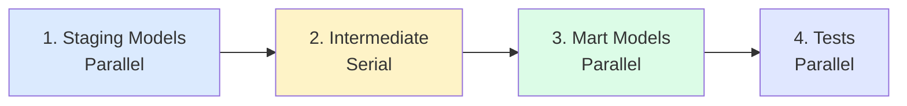

**Execution Time:** ~2-3 seconds for full build with sample data

---

## Model Statistics

| Model | Type | Rows | Columns | Tests | Build Time |
|-------|------|------|---------|-------|------------|
| stg_reddit__posts | View | 500 | 11 | 0 | <0.1s |
| stg_news__articles | View | 300 | 10 | 0 | <0.1s |
| int_sentiment_unified | Table | 800 | 23 | 0 | 0.4s |
| fct_sentiment_events | Incremental | ~800 | 20 | 8 | 0.3s |
| mart_daily_sentiment | Incremental | varies | 14 | 6 | 0.2s |

---

## Query Performance Tips

### Optimize Staging Queries
```sql
-- Use WHERE clauses early
SELECT *
FROM {{ ref('stg_reddit__posts') }}
WHERE published_at >= CURRENT_DATE - INTERVAL '30 days'  -- Filter early
    AND brand IN ('Coca-Cola', 'PepsiCo');  -- Reduce data volume
```

### Leverage Incremental Models
```sql
-- Query only recent data
SELECT *
FROM {{ ref('fct_sentiment_events') }}
WHERE published_date >= CURRENT_DATE - INTERVAL '7 days';
```

### Use Aggregates for Dashboards
```sql
-- Use pre-aggregated mart instead of raw events
SELECT *
FROM {{ ref('mart_daily_sentiment') }}
WHERE sentiment_date >= CURRENT_DATE - INTERVAL '30 days';
-- Much faster than aggregating fct_sentiment_events
```

---

## Data Quality Summary

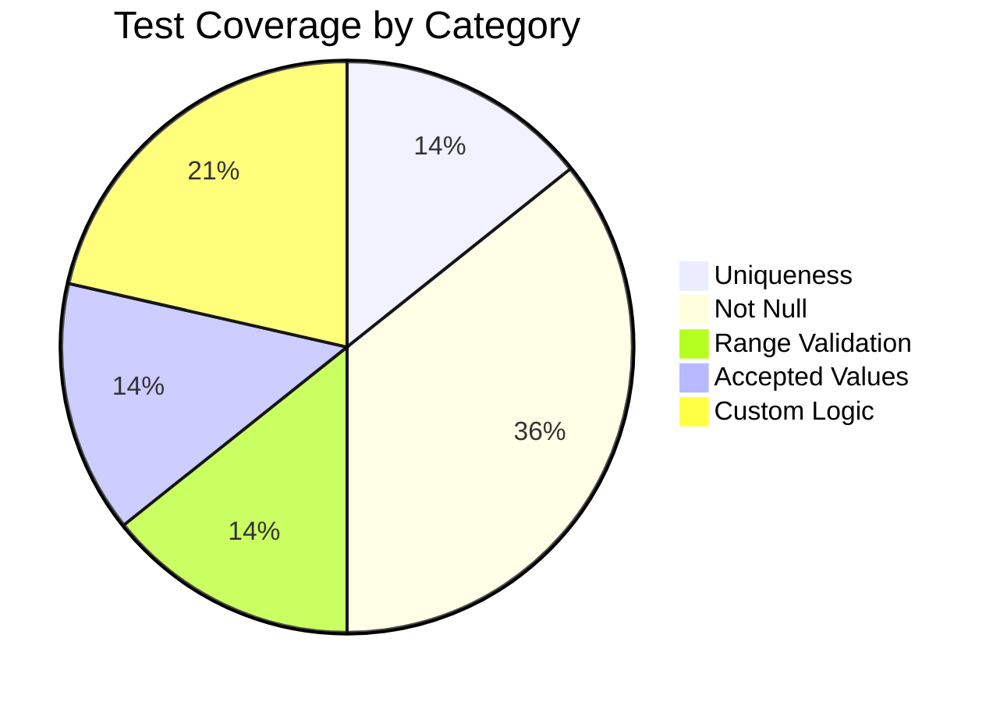

**Test Results:** ✅ 14/14 Passing

---

## Model Relationships

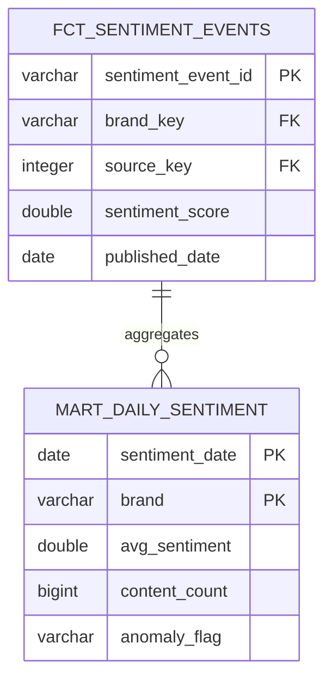

---

## Sentiment Distribution

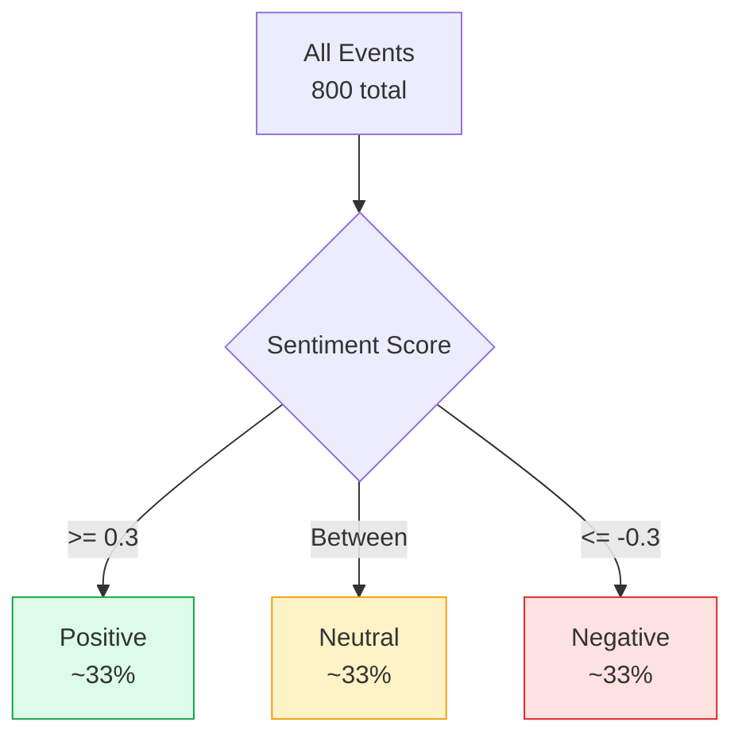

---

## Related Documentation

- [Lab 2 Overview](lab2-overview.md) - Architecture and features
- [Lab 2 Setup](lab2-setup.md) - Installation guide
- [Lab 2 Troubleshooting](lab2-troubleshooting.md) - Common issues
- [Lab 2 Quick Reference](lab2-quick-reference.md) - Common commands
- [dbt Documentation](https://docs.getdbt.com) - Official dbt docs

---

**Last Updated:** November 2025  
**Maintained By:** narensham  
**Total Models:** 5  
**Total Tests:** 14  
**Status:** ✅ Production Ready