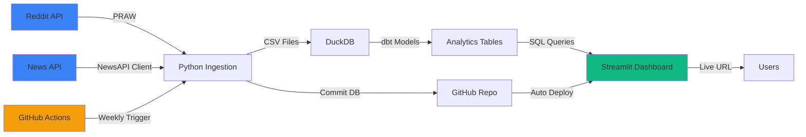

# Lab 2: Market Sentiment Analysis

## Overview

Lab 2 implements an **automated, production-ready market sentiment analysis pipeline** for Consumer Packaged Goods (CPG) brands. It ingests real data from Reddit and News APIs, performs sentiment analysis, tracks competitive intelligence, and provides interactive dashboards for brand monitoring.

!!! success "Live Demo Available"
    **🚀 View the live dashboard**: [https://buildcpg-labs-competitive-intelligence.streamlit.app/](https://buildcpg-labs-competitive-intelligence.streamlit.app/)
    
    The dashboard updates automatically every Sunday at 2 AM UTC via GitHub Actions!

**Key Highlights:**
- ✅ Real API integration (Reddit PRAW + NewsAPI)
- ✅ GitHub Actions automation (weekly runs)
- ✅ Shared brand taxonomy across labs
- ✅ Advanced competitive analytics
- ✅ Trending topics detection
- ✅ **Live Streamlit dashboards** (deployed on Streamlit Cloud)
- ✅ Production-grade data quality tests
- ✅ Zero infrastructure costs (free tier deployment)

## Purpose

Monitor and analyze public sentiment towards CPG brands to:

- 📊 **Track brand reputation** trends over time
- ⚠️ **Identify sentiment anomalies** requiring immediate attention
- 🏆 **Benchmark competitive positioning** across brands
- 🔥 **Detect trending topics** and emerging themes
- 📈 **Measure share of voice** and engagement metrics
- 🎯 **Inform brand strategy** with data-driven insights

## Live Dashboard

### 📊 Main Sentiment Dashboard
**URL**: [buildcpg-labs-competitive-intelligence.streamlit.app](https://buildcpg-labs-competitive-intelligence.streamlit.app/)

**What you'll see**:

#### KPI Metrics (Top Section)
- **Total Sentiment Events**: Count of Reddit posts + news articles analyzed
- **Average Sentiment**: Overall brand sentiment (-1 to 1 scale)
- **Unique Brands**: Number of brands tracked
- **Week-over-Week Trends**: ▲ or ▼ indicators showing change

#### Interactive Visualizations
1. **Sentiment Trend Over Time**
   - Dual-axis chart showing sentiment score and content volume
   - Filterable by date range, brand, and source

2. **Source Distribution**
   - Pie chart showing Reddit vs News API contribution
   - Click to see source-specific metrics

3. **Brand Sentiment Comparison**
   - Horizontal bar chart comparing all brands
   - Color-coded: Green (positive), Red (negative), Gray (neutral)

4. **Sentiment Distribution**
   - Category breakdown: Positive, Neutral, Negative
   - Percentage and count for each category

5. **Top Content Tables**
   - **Most Positive**: Best-performing brand mentions
   - **Most Negative**: Potential reputation risks
   - **Most Engaged**: High-visibility content (upvotes, shares)

6. **Anomaly Alerts** ⚠️
   - Statistical outliers flagged automatically
   - Z-score based detection (threshold: |z| > 2)

### 🏆 Competitive Intelligence Page
Navigate to **"Competitive Intelligence"** from the sidebar

**What you'll see**:

#### Share of Voice Analysis
- Top 15 brands by mention volume
- Percentage of total conversation
- Reddit vs News breakdown

#### Competitive Positioning Matrix
- **4-quadrant scatter plot**:
  - **X-axis**: Volume (mention count)
  - **Y-axis**: Sentiment score
  - **Classification**:
    - 🏆 Market Leader (high sentiment, high volume)
    - ⭐ Niche Favorite (high sentiment, low volume)
    - ⚠️ At Risk (low sentiment, high volume)
    - 📉 Low Visibility (low sentiment, low volume)

#### Trending Topics
- 8 tracked topics: Product Launch, Pricing, Quality Issues, Sustainability, etc.
- **Trending Score**: Combines recency, growth, and engagement
- **Status**: HOT, TRENDING, STABLE, EMERGING
- **Sentiment Tone**: POSITIVE_BUZZ, NEGATIVE_BUZZ, NEUTRAL_DISCUSSION

#### Brand Performance Table
- Net Sentiment Score (% positive - % negative)
- Engagement rate (Reddit only)
- Momentum indicator (7d vs 30d growth)
- Category benchmarks

### 📱 Dashboard Features

**Filters Available**:
- 📅 Date range picker
- 🏷️ Brand multi-select
- 📡 Source filter (Reddit, News, Both)
- 🎯 Sentiment category filter

**Refresh Strategy**:
- ⚡ **Data Cache**: 5-minute TTL (fast page loads)
- 🔄 **Weekly Updates**: Automated via GitHub Actions
- 🔄 **Manual Refresh**: Press 'R' key in browser

**Data Freshness**:
- Badge shows time since last pipeline run
- Typically: "Updated X days ago"
- Next update: Every Sunday 2 AM UTC

## Architecture

### End-to-End Data Flow



### Deployment Architecture

```
┌─────────────────────────────────────────────────────────┐
│              GITHUB REPOSITORY                           │
│  ┌─────────────────────────────────────────────────┐    │
│  │  Code + Database (lab2_market_sentiment.duckdb) │    │
│  └─────────────────────────────────────────────────┘    │
│                        ↓                                 │
│  ┌─────────────────────────────────────────────────┐    │
│  │  GitHub Actions (Weekly Workflow)               │    │
│  │  - Runs: Every Sunday 2 AM UTC                  │    │
│  │  - Fetches: Reddit + News data                  │    │
│  │  - Transforms: dbt models                       │    │
│  │  - Commits: Updated database                    │    │
│  └─────────────────────────────────────────────────┘    │
└─────────────────────────────────────────────────────────┘
                        ↓
┌─────────────────────────────────────────────────────────┐
│              STREAMLIT CLOUD                             │
│  ┌─────────────────────────────────────────────────┐    │
│  │  Auto-Deploy on Git Commit                      │    │
│  │  - Detects: Database changes                    │    │
│  │  - Rebuilds: Container (~30 seconds)            │    │
│  │  - Serves: Updated dashboard                    │    │
│  └─────────────────────────────────────────────────┘    │
└─────────────────────────────────────────────────────────┘
                        ↓
                  End Users
           (Access dashboard URL)
```

**Key Benefits**:
- ✅ **Serverless**: No infrastructure to manage
- ✅ **Automated**: Weekly updates without manual intervention
- ✅ **Free**: $0/month using only free tiers
- ✅ **Scalable**: Handle 1000s of daily visitors

### Data Pipeline Detailed

```
┌─────────────────────────────────────────────────────────┐
│              INGESTION LAYER                             │
│  Reddit API (PRAW) + News API → Python Scripts          │
│  ↓                                                       │
│  Raw CSV Files (data/raw/)                              │
│    - reddit_brands.csv                                  │
│    - news_brands.csv                                    │
└─────────────────────────────────────────────────────────┘
                        ↓
┌─────────────────────────────────────────────────────────┐
│            TRANSFORMATION LAYER (dbt)                    │
│  ┌─────────────────────────────────────┐                │
│  │  STAGING                            │                │
│  │  - stg_reddit__posts                │                │
│  │  - stg_news__articles               │                │
│  └──────────────┬──────────────────────┘                │
│                 ↓                                        │
│  ┌─────────────────────────────────────┐                │
│  │  INTERMEDIATE                       │                │
│  │  - int_sentiment_unified            │                │
│  │    (surrogate keys, enrichment)     │                │
│  └──────────────┬──────────────────────┘                │
│                 ↓                                        │
│  ┌─────────────────────────────────────┐                │
│  │  DIMENSIONS                         │                │
│  │  - dim_brands                       │                │
│  │  - dim_sources                      │                │
│  └──────────────┬──────────────────────┘                │
│                 ↓                                        │
│  ┌─────────────────────────────────────┐                │
│  │  MARTS (Analytics Layer)            │                │
│  │  - fct_sentiment_events             │                │
│  │  - mart_daily_sentiment             │                │
│  │  - mart_brand_competitive_analysis  │                │
│  │  - mart_trending_topics             │                │
│  └──────────────┬──────────────────────┘                │
└─────────────────┼───────────────────────────────────────┘
                  ↓
┌─────────────────────────────────────────────────────────┐
│           ANALYTICS & VISUALIZATION                      │
│  - Streamlit Dashboard (Main)                           │
│  - Competitive Intelligence Page                        │
│  - DuckDB Database (OLAP queries)                       │
└─────────────────────────────────────────────────────────┘
```

### Automation (Continued)

**GitHub Actions Workflow** (`weekly_pipeline.yml`):
- **Schedule**: Every Sunday at 2 AM UTC
- **Manual Trigger**: Available via GitHub Actions UI
- **Steps**:
  1. ✅ Checkout code
  2. ✅ Setup Python 3.11
  3. ✅ Install dependencies
  4. ✅ Install dbt packages
  5. ✅ Check for existing database
  6. ✅ Run data ingestion from APIs
  7. ✅ Execute dbt transformations (all 43 tests)
  8. ✅ Prune old data (keep last 90 days)
  9. ✅ Verify database (check size < 100MB)
  10. ✅ Commit updated database to repo
  11. ✅ Push changes
  12. ✅ Upload backup artifacts

**Total Runtime**: ~10-15 minutes per run

**Result**: Updated database committed → Streamlit auto-deploys → Users see fresh data

## Technology Stack

### Core Technologies

| Component | Technology | Version | Purpose |
|-----------|-----------|---------|---------|
| **Database** | DuckDB | 0.9.2 | Embedded OLAP database |
| **Transformation** | dbt-core + dbt-duckdb | 1.7.0 | SQL-based ELT framework |
| **Data Quality** | dbt tests + dbt_expectations | 0.10.4 | Automated testing |
| **Orchestration** | Prefect + GitHub Actions | 2.x | Workflow automation |
| **Ingestion** | Python (PRAW + NewsAPI) | 3.11+ | API data collection |
| **Sentiment Analysis** | VADER Sentiment | 3.3.2 | Text sentiment scoring |
| **Dashboards** | Streamlit + Plotly | 1.28.1 | Interactive visualization |
| **CI/CD** | GitHub Actions | N/A | Automated pipeline |

### Lab 2 Specific APIs

| API | Client Library | Free Tier | Purpose |
|-----|---------------|-----------|---------|
| **Reddit** | PRAW 7.7.0 | Unlimited | Social media discussions |
| **News** | newsapi-python 0.2.7 | 100 req/day | Professional journalism |

### Deployment Stack

| Service | Plan | Cost | Purpose |
|---------|------|------|---------|
| **GitHub** | Free | $0 | Code + DB storage + CI/CD |
| **Streamlit Cloud** | Free | $0 | Dashboard hosting |
| **GitHub Actions** | Free (2000 min/mo) | $0 | Weekly automation |

**Total Infrastructure Cost**: **$0/month** 🎉

## Shared Brand Taxonomy

**New in v2:** Lab 2 now uses a **shared brand taxonomy** located in `buildcpg-labs/shared/config/brand_taxonomy.yaml`.

### Benefits:
- ✅ **Single source of truth** for brand data across all labs
- ✅ **Consistent parent company mapping**
- ✅ **Standardized category classifications**
- ✅ **Easy to extend** with new brands

### Structure:

```yaml
beverages:
  coca_cola:
    parent: "The Coca-Cola Company"
    ticker: "KO"
    brands:
      - name: "Coca-Cola"
        aliases: ["Coke", "Coca Cola"]
        category: "Carbonated Soft Drinks"
      - name: "Sprite"
        aliases: ["Sprite Zero"]
        category: "Lemon-Lime Soda"
      - name: "Fanta"
        category: "Fruit Soda"
```

### Current Brands Tracked

**60+ brands** across multiple CPG categories:

- **Beverages**: Coca-Cola, Pepsi, Red Bull, Monster, Gatorade, etc.
- **Snacks**: Lay's, Doritos, Cheetos, Pringles, etc.
- **Personal Care**: Dove, Axe, Degree, etc.
- **Household**: Tide, Downy, Febreze, etc.

See the [full taxonomy](https://github.com/NarenSham/buildcpg-labs/blob/main/shared/config/brand_taxonomy.yaml) on GitHub.

### Usage:

Ingestion scripts automatically load the taxonomy:

```python
from pathlib import Path
import yaml

# Try shared config first, fall back to lab-specific
SHARED_CONFIG = Path("../shared/config/brand_taxonomy.yaml")
taxonomy = yaml.safe_load(open(SHARED_CONFIG))
```

## Data Models

See the [Data Models Reference](lab2-data-models.md) for complete schemas and examples.

### Quick Overview

| Layer | Models | Purpose |
|-------|--------|---------|
| **Staging** | 2 models | Clean and normalize raw data |
| **Intermediate** | 1 model | Unified sentiment with enrichment |
| **Dimensions** | 2 models | Brand and source master data |
| **Marts** | 4 models | Business-ready analytics tables |

**Total**: 9 models, 43 tests (all passing ✅)

### Key Marts

1. **`fct_sentiment_events`** - Event-level fact table (grain: one row per post/article)
2. **`mart_daily_sentiment`** - Daily aggregates with anomaly detection
3. **`mart_brand_competitive_analysis`** ⭐ - Share of voice, positioning, rankings
4. **`mart_trending_topics`** ⭐ - Topic extraction with trending scores

## Key Features

### 1. Real-Time Sentiment Tracking
- Continuous monitoring of 60+ brands
- VADER sentiment analysis (-1 to 1 scale)
- Three categories: Positive, Neutral, Negative
- Configurable thresholds

### 2. Competitive Intelligence
- Share of voice calculation
- Competitive positioning matrix
- Category benchmarking
- Net sentiment score (% positive - % negative)

### 3. Trending Topics Detection
- 8 pre-defined topics tracked
- Keyword-based extraction
- Trending score algorithm
- Status classification: HOT, TRENDING, STABLE, EMERGING

### 4. Anomaly Detection
- Statistical z-score based
- Flags days with unusual sentiment
- Threshold: |z-score| > 2
- Useful for PR crisis detection

### 5. Automated Pipeline
- GitHub Actions runs weekly
- No manual intervention required
- Automatic database commits
- Streamlit auto-deploys on changes

### 6. Production-Ready Quality
- 43 dbt tests (all passing)
- Data contracts enforced
- Comprehensive error handling
- Logging throughout

## Metrics Available

### Event-Level Metrics (`fct_sentiment_events`)

- Sentiment score (-1 to 1)
- Sentiment category (positive/neutral/negative)
- Engagement count (upvotes, comments, shares)
- Content quality flag
- Published date/time (with date parts)
- Brand, parent company, category
- Source (Reddit vs News)
- Headline and body text

### Daily Aggregate Metrics (`mart_daily_sentiment`)

- Average, min, max, stddev sentiment
- Content counts (total, by category)
- Positive ratio
- Total and average engagement
- Source diversity
- Z-score for anomaly detection
- Anomaly flag (NORMAL/ANOMALY)

### Competitive Metrics (`mart_brand_competitive_analysis`)

- Share of voice (%)
- Net sentiment score (positive % - negative %)
- Sentiment and volume percentile ranks
- Engagement rate
- Momentum (7d vs 30d growth %)
- Competitive position classification
- Sentiment vs category benchmark
- Category and parent company averages

### Topic Metrics (`mart_trending_topics`)

- Trending score
- Mention count (total, 7d, 14d)
- Sentiment breakdown
- Engagement metrics
- Trend status (HOT, TRENDING, etc.)
- Sentiment tone (POSITIVE_BUZZ, etc.)
- Topic rank within brand

## Getting Started

Ready to build this yourself or deploy your own version?

1. **[Setup Guide](lab2-setup.md)** - Complete installation and deployment instructions
2. **[API Integration Guide](lab2-api-integration.md)** - How to work with Reddit and News APIs
3. **[Architecture Details](lab2-architecture.md)** - Deep dive into system design
4. **[Quick Reference](lab2-quick-reference.md)** - Common commands and queries

## Current Status

### ✅ Completed

- ✅ Real API integration (Reddit PRAW, NewsAPI)
- ✅ Shared brand taxonomy architecture
- ✅ GitHub Actions automation
- ✅ Prefect orchestration
- ✅ VADER sentiment analysis
- ✅ All 4 mart tables (events, daily, competitive, topics)
- ✅ 43 data quality tests (all passing)
- ✅ Main Streamlit dashboard
- ✅ Competitive Intelligence page
- ✅ **Production deployment on Streamlit Cloud**
- ✅ Full documentation

### 🔄 In Progress

- 🔄 Advanced NLP topic extraction (vs keyword matching)
- 🔄 Hugging Face transformer sentiment (vs VADER)
- 🔄 Email alerting for anomalies

### 📋 Planned

- 📋 Historical backfill (6+ months of data)
- 📋 ML-based sentiment prediction
- 📋 Correlation analysis (sentiment vs stock prices)
- 📋 Slack/Teams integration for alerts
- 📋 Export to BigQuery for larger-scale analysis

## Performance Metrics

**Pipeline Runtime** (typical weekly run):
- Ingestion: 5-10 minutes (100 posts per brand)
- dbt build: 2-3 minutes (incremental)
- Total: **~10-15 minutes** end-to-end

**Data Volumes** (typical weekly run):
- Reddit posts: 500-1,000
- News articles: 300-500
- Total sentiment events: 800-1,500
- Daily aggregates: 50-100 rows
- Database size: 7-8 MB

**Dashboard Performance**:
- Initial load: 2-3 seconds
- Filter updates: <1 second (cached)
- Data refresh: 5 minutes (TTL)
- Can handle: 1000s of concurrent users

## Try It Now

!!! tip "Explore the Live Dashboard"
    **Main Dashboard**: [https://buildcpg-labs-competitive-intelligence.streamlit.app/](https://buildcpg-labs-competitive-intelligence.streamlit.app/)
    
    **Things to try**:
    - 🔍 Filter by specific brands (e.g., "Coca-Cola", "Pepsi")
    - 📅 Adjust date range to see trends
    - 📊 Navigate to Competitive Intelligence page (sidebar)
    - 🔥 Check trending topics
    - ⚠️ Look for anomaly alerts
    - 📈 Compare sentiment across brands

## Related Documentation

- [Lab 2 Setup Guide](lab2-setup.md) - Installation and deployment
- [Lab 2 Troubleshooting](lab2-troubleshooting.md) - Common issues and solutions
- [API Integration Guide](lab2-api-integration.md) - Working with Reddit and News APIs
- [Data Models Reference](lab2-data-models.md) - Complete schema documentation
- [Quick Reference](lab2-quick-reference.md) - Common commands and queries

---

**Lab Owner**: narensham  
**Created**: November 2025  
**Last Updated**: November 2025  
**Status**: ✅ Production-Ready  
**Live Dashboard**: [buildcpg-labs-competitive-intelligence.streamlit.app](https://buildcpg-labs-competitive-intelligence.streamlit.app/)