```mermaid
graph TB
    A[Catalog Error:<br/>Table combined does not exist] --> B[Root Cause:<br/>Broken CTE Chain]
    B --> C[Missing Comma]
    B --> D[Extra Comma]
    B --> E[Wrong Nesting]
    
    C --> F[Solution:<br/>Fix CTE Structure]
    D --> F
    E --> F
    
    F --> G[✅ Compilation Success]
    
    style A fill:#fee2e2,stroke:#dc2626
    style G fill:#dcfce7,stroke:#16a34a
```

```mermaid
graph TB
    A[Schema Out of Sync Error] --> B{Resolution Strategy}
    B -->|Quick Fix| C[Drop & Rebuild]
    B -->|Preserve Data| D[Add on_schema_change]
    B -->|Manual| E[ALTER TABLE]
    
    C --> F[dbt run --full-refresh]
    D --> G[on_schema_change config]
    E --> H[Manual SQL ALTER]
    
    F --> I[✅ Resolved]
    G --> I
    H --> I
    
    style A fill:#fef3c7
    style I fill:#dcfce7
```

# Lab 2: Troubleshooting Guide

Comprehensive solutions to all issues encountered in the Market Sentiment Analysis lab, with diagrams and step-by-step fixes.

## Critical Issues

### Issue #1: Duplicate sentiment_event_id (800 duplicates)

**Severity:** 🔴 Critical  
**Impact:** Data quality test failure, invalid fact table  
**Status:** ✅ Resolved



```mermaid
graph TB
    A[Problem: 800 Duplicates] --> B[Root Cause 1:<br/>Wrong Config Param]
    A --> C[Root Cause 2:<br/>Double WHERE Clause]
    A --> D[Root Cause 3:<br/>Weak Surrogate Key]
    A --> E[Root Cause 4:<br/>Data Type Mismatch]
    
    B --> F[Solution 1:<br/>unique_key not unique_id]
    C --> G[Solution 2:<br/>Fix CTE Structure]
    D --> H[Solution 3:<br/>Add source to key]
    E --> I[Solution 4:<br/>Use BIGINT not INTEGER]
    
    F --> J[✅ All Tests Pass]
    G --> J
    H --> J
    I --> J
    
    style A fill:#fee2e2,stroke:#dc2626
    style J fill:#dcfce7,stroke:#16a34a
```

#### Root Cause Analysis

**1. Wrong Config Parameter**
```sql
-- ❌ WRONG (in fct_sentiment_events.sql)
{{ config(
  materialized='incremental',
  unique_id='sentiment_event_id',  -- Wrong parameter name
  ...
) }}
```

**Impact:** dbt doesn't use this key for deduplication, allowing duplicates to accumulate.

**2. Double WHERE Clause**
```sql
-- ❌ WRONG SQL Structure
FROM {{ ref('int_sentiment_unified') }}


    WHERE published_at > (SELECT MAX(published_at) FROM {{ this }})


WHERE quality_flag = 'VALID'  -- ❌ Second WHERE clause = SQL error
```

**Impact:** SQL compilation error or incorrect filtering logic.

**3. Insufficient Surrogate Key**
```sql
-- ❌ WEAK: Only uses 2 fields
{{ generate_surrogate_key(['content_id', 'published_at']) }}
```

**Impact:** Same content_id + timestamp from different sources creates collisions.

**4. Data Type Mismatch**
```sql
-- ❌ SQL produces INTEGER
CAST(EXTRACT(YEAR FROM published_at) AS INTEGER) as published_year

-- ✅ Contract expects BIGINT
data_type: bigint
```

**Impact:** Contract enforcement fails, model doesn't build.

#### Complete Solution

**Step 1: Fix Config Parameter**

```sql
{{ config(
  materialized='incremental',
  unique_key='sentiment_event_id',  -- ✅ CORRECT
  tags=['mart', 'facts'],
  description='Fact table: One row per sentiment event',
  incremental_strategy='delete+insert'
) }}
```

**Step 2: Fix WHERE Clause with CTE**

```sql
-- ✅ CORRECT SQL Structure
WITH base_data AS (
    SELECT *,
        -- Calculate quality_flag in CTE
        CASE 
            WHEN NOT {{ validate_sentiment('sentiment_score') }} THEN 'INVALID_SENTIMENT'
            WHEN headline IS NULL THEN 'NULL_HEADLINE'
            ELSE 'VALID'
        END as quality_flag
    FROM {{ ref('int_sentiment_unified') }}
    
    
    WHERE published_at > (SELECT MAX(published_at) FROM {{ this }})
    
)

SELECT * FROM base_data
WHERE quality_flag = 'VALID'  -- ✅ Single WHERE clause
```

**Step 3: Enhance Surrogate Key**

```sql
-- ✅ STRONG: Uses 3 fields including source
{{ generate_surrogate_key(['content_id', 'published_at', 'source']) }}
```

**Step 4: Fix Data Types**

```sql
-- ✅ CORRECT: Match contract expectations
CAST(engagement_count AS BIGINT) as engagement_count,
CAST(EXTRACT(YEAR FROM published_at) AS BIGINT) as published_year,
CAST(EXTRACT(MONTH FROM published_at) AS BIGINT) as published_month,
CAST(EXTRACT(DAYOFWEEK FROM published_at) AS BIGINT) as published_day_of_week,
CAST(EXTRACT(HOUR FROM published_at) AS BIGINT) as published_hour,
```

#### Verification

```bash
# Run dbt with full refresh
cd dbt
dbt clean
dbt build --full-refresh

# Check uniqueness test
dbt test --select unique_fct_sentiment_events_sentiment_event_id

# Expected output:
# ✅ PASS unique_fct_sentiment_events_sentiment_event_id
```

#### Prevention


---

### Issue #2: Contract Enforcement Failures

**Severity:** 🟡 High  
**Impact:** Model won't build with enforced contracts  
**Status:** ✅ Resolved



```mermaid
graph TB
    A[Contract Enforcement Error] --> B{Error Type}
    B -->|Data Type| C[Type Mismatch]
    B -->|Missing Column| D[Schema Incomplete]
    B -->|Schema Change| E[Incremental Conflict]
    
    C --> F[Solution: Match Types]
    D --> G[Solution: Add Columns]
    E --> H[Solution: on_schema_change]
    
    F --> I[✅ Build Success]
    G --> I
    H --> I
    
    style A fill:#fef3c7,stroke:#f59e0b
    style I fill:#dcfce7,stroke:#16a34a
```

#### Symptoms

```
Compilation Error: This model has an enforced contract that failed.

| column_name       | definition_type | contract_type | mismatch_reason    |
| engagement_count  | INTEGER         | BIGINT        | data type mismatch |
| published_year    | INTEGER         | BIGINT        | data type mismatch |
```

#### Root Cause

SQL produces `INTEGER` but contract expects `BIGINT` in DuckDB.

#### Solution Approaches

**Approach 1: Update SQL to Match Contract** (Recommended)

```sql
-- Change all INTEGER casts to BIGINT
CAST(engagement_count AS BIGINT) as engagement_count,
CAST(source_key AS INTEGER) as source_key,  -- This one stays INTEGER
```

**Approach 2: Update Contract to Match SQL**

```yaml
# In schema.yml
columns:
  - name: engagement_count
    data_type: bigint  # Match what SQL actually produces
```

**Approach 3: Remove Contract** (If too strict)

```yaml
# In schema.yml - comment out contract
# contract:
#   enforced: true
```

#### For Incremental Models with Contracts

```sql
{{ config(
  materialized='incremental',
  unique_key='sentiment_event_id',
  on_schema_change='append_new_columns',  -- ✅ REQUIRED with contracts
  contract={
    'enforced': true
  }
) }}
```

**Valid `on_schema_change` values with contracts:**
- `append_new_columns` ✅
- `fail` ✅
- `sync_all_columns` ❌ (not allowed)

#### Contract Validation Checklist

```mermaid
graph LR
    A[Define Contract] --> B[Write SQL]
    B --> C[dbt compile]
    C --> D{Types Match?}
    D -->|Yes| E[dbt run]
    D -->|No| F[Fix Mismatches]
    F --> B
    E --> G{Build Success?}
    G -->|Yes| H[✅ Done]
    G -->|No| I[Check Error]
    I --> F
    
    style H fill:#dcfce7
```



---

### Issue #3: CTE Reference Errors

**Severity:** 🔴 Critical  
**Impact:** Model compilation failure  
**Status:** ✅ Resolved



#### Error Message

```
Runtime Error: Catalog Error: Table with name combined does not exist!
Did you mean "temp.information_schema.columns"?
```

#### Root Cause

Incorrect CTE chain structure - comma placement breaks the flow.

#### Wrong CTE Structure

```sql
-- ❌ WRONG: Comma after combined closes the chain
combined AS (
    SELECT * FROM reddit_refined
    UNION ALL
    SELECT * FROM news_refined
),  -- ❌ This comma closes the CTE chain

-- Now "combined" is out of scope
with_surrogate_keys AS (
    SELECT ... FROM combined  -- ❌ Error: combined doesn't exist
)
```

#### Correct CTE Structure

```sql
-- ✅ CORRECT: Continuous chain with proper commas
WITH reddit_refined AS (
    SELECT ...
),

news_refined AS (
    SELECT ...
),

combined AS (
    SELECT * FROM reddit_refined
    UNION ALL
    SELECT * FROM news_refined
),  -- ✅ Comma continues chain

with_surrogate_keys AS (
    SELECT ... FROM combined  -- ✅ combined is in scope
),

final AS (
    SELECT ... FROM with_surrogate_keys
)  -- ✅ No comma on last CTE

SELECT * FROM final  -- Main query
```

#### CTE Structure Rules


**Rules:**
1. Start with `WITH`
2. Separate CTEs with commas
3. NO comma after last CTE
4. End with main `SELECT`

---

## dbt Issues

### Issue #4: dbt deps Package Warning

**Severity:** 🟡 Low  
**Impact:** Deprecation warning, works but should upgrade  
**Status:** ⚠️ Advisory

```
[WARNING]: Deprecated functionality
The `calogica/dbt_expectations` package is deprecated in favor of
`metaplane/dbt_expectations`. Please update your `packages.yml`
```

#### Solution

Update `packages.yml`:

```yaml
# ❌ OLD (deprecated)
packages:
  - package: calogica/dbt_expectations
    version: 0.10.4

# ✅ NEW (recommended)
packages:
  - package: metaplane/dbt_expectations
    version: 0.10.4
```

Then:
```bash
dbt clean
rm -rf dbt_packages/
dbt deps
```

---

### Issue #5: Incremental Schema Out of Sync

**Severity:** 🟡 High  
**Impact:** Incremental model won't run  
**Status:** ✅ Resolved



#### Error Message

```
The source and target schemas on this incremental model are out of sync!
Source columns not in target: [stddev_sentiment, z_score_sentiment, anomaly_flag]
```

#### Quick Fix: Drop and Rebuild

```bash
# Option 1: Python script
python -c "
import duckdb
conn = duckdb.connect('data/lab2_market_sentiment.duckdb')
conn.execute('DROP TABLE IF EXISTS main.mart_daily_sentiment')
conn.close()
print('✅ Table dropped')
"

# Option 2: dbt full-refresh
dbt run --full-refresh --select mart_daily_sentiment
```

#### Permanent Fix: Add Config

```sql
{{ config(
  materialized='incremental',
  on_schema_change='append_new_columns',  -- ✅ Add this
  ...
) }}
```

**Valid options:**
- `fail` - Fail on schema change (safe)
- `append_new_columns` - Add new columns automatically
- `ignore` - Ignore schema changes (dangerous)

---

### Issue #6: Profile Not Found

**Severity:** 🔴 Critical  
**Impact:** Can't connect to database  
**Status:** ✅ Resolved

```mermaid
graph LR
    A[Profile Not Found] --> B{Check Location}
    B -->|Wrong Name| C[Fix